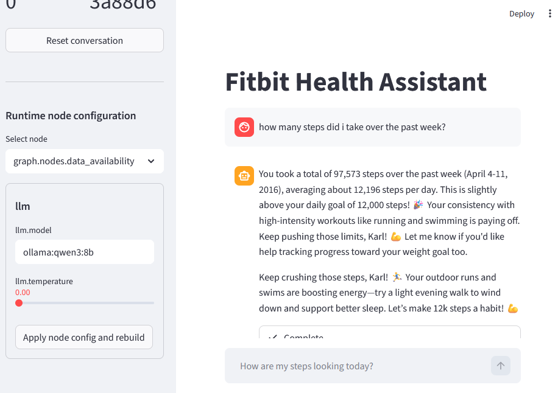
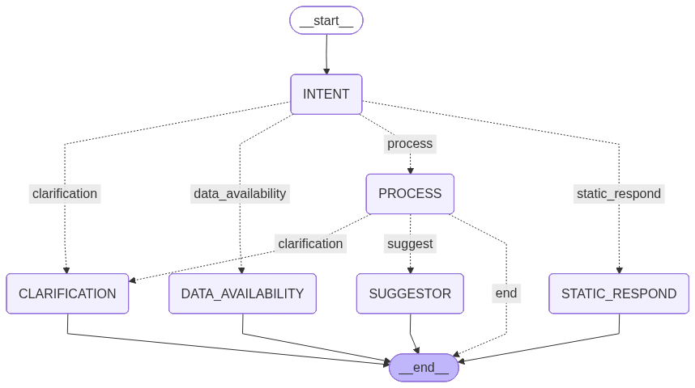
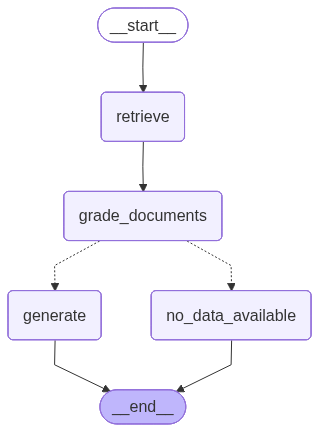

# Fitbit Bot - Conversational Health Assistant

## Overview

This project implements a conversational AI assistant that processes Fitbit-style health data. A LangGraph workflow routes each user message through intent classification, clarification, data availability, static responses, and a data-processing execution node.

The assistant can:
- Answer questions about health metrics (steps, heart rate, calories, weight)
- Provide coaching suggestions based on user profile data
- Use a knowledge base (RAG) for general health questions
- Execute SQL queries against a local SQLite database

## Safety Disclaimer

This repository is a proof-of-concept example. The knowledge base content was generated with ChatGPT and is not a reliable source of medical information. Do not use this system for medical advice or clinical decisions.

## Architecture

Main graph flow (see `graph/graph.py`):

```
INTENT -> CLARIFICATION | STATIC_RESPOND | DATA_AVAILABILITY | PROCESS
PROCESS -> CLARIFICATION | SUGGESTOR | END
```

Diagrams:






Key components:
- LangGraph for orchestration
- LangChain for LLM integration and tool calling
- SQLite for Fitbit data
- Chroma for vector search (RAG)
- Streamlit UI

The RAG pipeline is implemented as a subgraph under `graph/process/rag_retriever` and used as a tool by the execution agent.

## Project Structure

```
fitbit_bot/
|-- app/
|   |-- app.py                 # Streamlit UI
|   `-- config.json            # Runtime configuration
|-- graph/
|   |-- graph.py               # Main LangGraph workflow
|   |-- state.py               # State schema
|   |-- nodes/                 # Intent, clarification, static, suggestor
|   |-- chains/                # Prompt + model chains
|   |-- agents/                # Suggestor agent
|   |-- process/               # Execution agent and tools
|   |   |-- agents/            # Execution + SQL agent
|   |   |-- tools/             # SQL and RAG tools
|   |   `-- rag_retriever/      # RAG subgraph
|   |-- prompts/               # Prompt templates
|   `-- tools/                 # Shared tool definitions
|-- dataset/
|   |-- fitbit_data_ingestion_sqlite3.py
|   |-- health_kb_loader.py
|   |-- populate_user_profile.py
|   |-- db/                    # SQLite DB + vector store (not checked in)
|   |-- clean/                 # Processed CSVs (not checked in)
|   `-- user_profiles/         # User profile JSON files (generated)
|-- tests/
|-- main.py
|-- pyproject.toml
`-- README.md
```

Note: `.gitignore` excludes `.env`, `.venv`, `.sqlite`, `.sqlite3`, `.bin`, `.csv`, and other local artifacts. You must generate the DB, KB, and user profiles locally.

## Prerequisites

Required:
- Python 3.11+
- uv (https://astral.sh/uv) or another Python environment manager
- kagglehub for dataset download (installed via dependencies)
- Ollama running locally for the default config

Optional (depending on your config):
- OpenAI API key (if you switch embeddings or models to OpenAI)
- Anthropic API key (if you switch models to Anthropic)
- LangSmith credentials (the RAG generation chain pulls a prompt repo by default)

## Installation

```bash
# From the repo root
uv venv
.venv\Scripts\Activate.ps1   # Windows PowerShell
# source .venv/bin/activate   # macOS/Linux

uv pip install -e .
```

Create a `.env` file in the project root if needed:

```bash
# Optional: LangSmith
LANGSMITH_API_KEY=your_key
LANGSMITH_TRACING=true
LANGSMITH_PROJECT=fitbit-bot

# Optional: Anthropic
ANTHROPIC_API_KEY=your_key

# Optional: OpenAI
OPENAI_API_KEY=your_key
```

## Models and Providers

The default runtime config uses Ollama models defined in `app/config.json`. Make sure Ollama is installed and running.

Example model pulls (match `app/config.json`):

```bash
ollama pull qwen3:8b
ollama pull gemma3:270m
ollama pull mxbai-embed-large:335m
```

If you want to use OpenAI or Anthropic models instead:
- Update the model strings under `runtime_nodes` in `app/config.json` to the provider you want.
- Ensure the matching API key is set in `.env`.
- For embeddings, update the retriever config in `app/config.json` or the ingestion defaults in `graph/consts.py`.

## Data Setup (Optional)

If the dataset, DB, or KB are missing, rebuild them locally:

```bash
# Download Fitbit data from Kaggle and build SQLite + clean CSVs
python dataset/fitbit_data_ingestion_sqlite3.py

# Generate user profiles from the DB
python dataset/populate_user_profile.py

# Build the knowledge base (Chroma)
python dataset/health_kb_loader.py
```

To run the full data setup in one shot (ingestion, profiles, KB), use:

```bash
python dataset/generate_dataset.py
```

Kaggle ingestion requires Kaggle credentials to be available to `kagglehub`.

## Running the Application

```bash
streamlit run app/app.py
```

The UI exposes controls for:
- intent model
- confidence threshold
- execution history limit
- execution max iterations
- suggestor toggle

## Configuration

Runtime settings live in `app/config.json`. The file uses a flat `runtime_nodes` map. Key entries include:

- `graph.nodes.intent`
- `graph.nodes.request_clarification`
- `graph.nodes.data_availability`
- `graph.nodes.static_response`
- `graph.process.nodes.execution`
- `graph.process.nodes.sql_agent`
- `graph.process.nodes.sql_validation`
- `graph.process.rag_retriever`
- `graph.process.nodes.suggestor`

Model strings are passed directly to `init_chat_model` (for example `ollama:qwen3:8b`). Embedding provider selection is controlled in the RAG retriever config and in `graph/consts.py` for ingestion defaults.

The process node (`graph/process/process.py`) loads configuration via references in `graph.process.nodes.execution`:
- `sql_config_ref` (defaults to `graph.process.nodes.sql_agent`)
- `sql_validation_config_ref` (defaults to `graph.process.nodes.sql_validation`)
- `rag_config_ref` (defaults to `graph.process.rag_retriever`)

If you rename these keys or move blocks in `app/config.json`, update the references accordingly.

## Development

Changing config:
- Update `app/config.json` under `runtime_nodes` to change models, temperatures, and node behavior.
- If you add a new node or chain, wire it in `graph/graph.py` and add its config block in `app/config.json`.
- If you modify a chain prompt, update the corresponding file in `graph/prompts/` and re-run the relevant tests.

Changing chains and nodes:
- Chains live in `graph/chains/` and are called by nodes in `graph/nodes/`.
- If you change a chain interface (input keys or output shape), update the node that calls it and the tests in `graph/chains/tests` and `graph/nodes/tests`.
- If you add or remove tools, update `graph/process/agents/execution.py` and `graph/process/tools/`.

## Testing

Live integration tests (LLMs, DB, KB) are under:

```
python -m pytest graph/chains/tests graph/nodes/tests graph/process/tests
```

Run from the repo root. These tests require Ollama to be running and the SQLite DB and KB to exist.

Legacy tests in `tests/` are not kept in sync with the current graph flow.

## Future Work and Known Limitations

- Tests are rudimentary and most require LLMs as judges. The evaluation framework needs more work.
- User preferences are not stored as real long-term memory. The system currently loads mock user profiles from JSON files and does not persist updates.
- Source grounding is incomplete. Classes like `Fact` and `SourceRef` exist in `graph/schemas.py`, but the runtime does not enforce that responses are grounded only in retrieved sources. This can allow hallucinations.
- RAG quality depends on the generated knowledge base and should not be treated as authoritative.
- The Fitbit dataset covers a single month in 2016. The system also hardcodes "today" as `2016-04-11` in `graph/consts.py`.
- Add node-level instrumentation and self-reporting, enabling each node to emit structured logs of its decisions and actions for transparent visualization in the Streamlit UI

## Acknowledgments

- Fitbit dataset on Kaggle: https://www.kaggle.com/datasets/arashnic/fitbit
